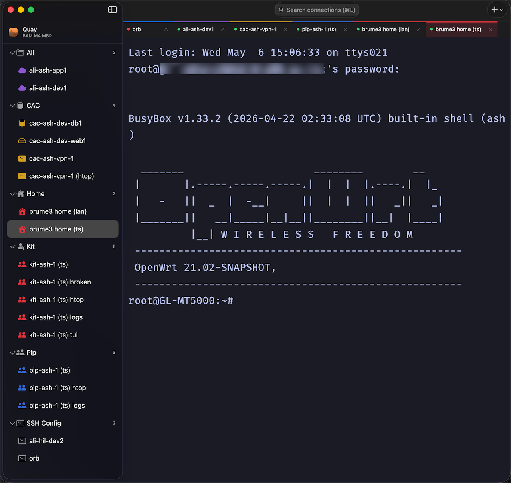

<p align="center">
  
</p>

<h1 align="center">Quay</h1>

<p align="center">
  Native macOS SSH &amp; SFTP connection manager — free, no subscription.<br>
  <sub>Built on <a href="https://ghostty.org">Ghostty</a>'s terminal core &nbsp;·&nbsp; macOS 14+ &nbsp;·&nbsp; Apple Silicon</sub>
</p>

<p align="center">
  
</p>

---

*A quay (/kiː/, "key") is a solid structure built along the edge of a harbor where ships come alongside to moor and unload — the place where vessels meet the shore. A fitting name for an app that's your Mac's edge, where remote hosts tie up. (Some say "kay." You do you!)*

## Why Quay?

- **Free.** No subscription, no account, no telemetry.
- **Native.** Built in Swift on Ghostty's terminal core — no Electron, no background Chromium process eating your CPU or battery.
- **Stays out of your way.** Your existing `~/.ssh/config`, SSH keys, macOS Keychain, and 1Password SSH agent all work without any Quay-specific setup.

If you're managing remote hosts and don't want to pay a monthly fee for it, Quay is worth a look.

## Install

1. Download the latest **Quay.dmg** from [Releases](https://github.com/babul/quay/releases/latest).
2. Drag **Quay** to `/Applications`.
3. Launch. Future updates arrive automatically via Sparkle.

**Requirements:** macOS 14 (Sonoma) or newer · Apple Silicon (arm64)

> Want to build from source? See [Building from source](#building-from-source) below.

## Features

- **Multi-tab SSH sessions** (one per tab)
- **Login scripts** (run commands after the shell opens; step values can be locked into macOS Keychain so no password ever touches the on-disk store)
- **SFTP** (easy file transfer with macOS built-in sftp, OpenSSH, or lftp)
- **`~/.ssh/config` integration** — your existing config hosts appear in the sidebar automatically, no re-entry
- **Color tags** (for easy identification of different hosts)
- **Keychain auth** (no more typing passwords — for SSH credentials and locked login-script steps)
- **Import/Export Settings** (save and load multiple connections; password-encrypt the bundle to transfer securely to a new Mac or a colleague)
- **Light/Dark mode** (built-in)
- **Automatic updates** (via Sparkle)
- **Saved state** (window positions, search, etc. all saved and restored on app launch)

## Privacy

Quay makes no network calls except the SSH connections you explicitly open. There is no telemetry, no analytics, and no crash reporting. The only data that ever leaves your machine is what `/usr/bin/ssh` sends to hosts you configure. Sparkle is used to deliver updates hosted from GitHub.

## Adding your first connection

1. Click the **+** menu in the bottom-left of the sidebar → **New Connection…**
2. Fill in `Display name`, `Hostname`, and `Username`.
3. Pick an auth method:

   | Method | How it works |
   |---|---|
   | **OpenSSH defaults** | Tries your SSH keys, then prompts for a password in the terminal if needed |
   | **Private key** | Passes a specific key file to ssh |
   | **Private key + passphrase** | As above; reads the passphrase from your Mac's Keychain |
   | **Password** | Reads the password from your Mac's Keychain — no typing required |
   | **ssh.config alias** | Delegates entirely to a `Host` block in `~/.ssh/config` |

   **Quay never stores your passwords or keys.** Your Mac handles authentication — via SSH keys on disk, the system SSH agent, macOS Keychain, or 1Password if you have its [SSH agent](https://developer.1password.com/docs/ssh/agent/) enabled. The `keychain://service/account` secret reference just tells Quay where on your Mac to look; the credential itself lives in Keychain, not in Quay.

4. Hit **Save**, click the connection, terminal opens.

## Organizing connections

Connections are grouped into **folders** in the sidebar. Create a folder via the **+** menu → **New Group**, then add connections to it. Folders can be collapsed to keep the sidebar tidy.

Press **⌘L** to focus the search field and filter connections by name — results are ranked by fuzzy match so partial strings work fine.

## Keyboard shortcuts

| Shortcut | Action |
|---|---|
| **⌃Tab** | Switch to next tab (wraps) |
| **⌃⇧Tab** | Switch to previous tab (wraps) |
| **⌘L** | Focus sidebar search |
| **⌘B** | Toggle sidebar |
| **⌘⇧R** | Reload Ghostty config |

## Terminal configuration

Quay's terminal is powered by [Ghostty](https://ghostty.org)'s terminal core and reads the same config file Ghostty uses — `~/.config/ghostty/config` (or `~/Library/Application Support/com.mitchellh.ghostty/config` if that's where yours lives). Any change you make there affects Quay.

**If you don't have Ghostty installed or have no config file**, Quay's built-in defaults give you:

| Setting | Value |
|---|---|
| Font | SF Mono 13 |
| Theme | Ghostty default |
| Cursor | Block, no blink |
| Padding | 8 px horizontal, 6 px vertical |
| Scrollback | 100,000 lines |

Use **Terminal → Open Ghostty Config** to open the config in your default text editor (creating the file if it doesn't exist yet). Use **Terminal → Reload Ghostty Config** (⌘⇧R) to pick up changes without restarting Quay.

For the full list of available settings — fonts, colors, keybindings, window decorations, and more — see the [Ghostty configuration reference](https://ghostty.org/docs/config).

**Light and dark themes** can be set per color scheme with a single line:

```
theme = light:GitHub Light,dark:GitHub Dark
```

Quay automatically tells Ghostty which scheme is active as macOS switches appearance.

## ~/.ssh/config hosts

Quay reads `~/.ssh/config` on launch and shows every concrete `Host` alias in a collapsible **~/.ssh/config** section at the bottom of the sidebar. Click any host to open a terminal immediately — Quay delegates entirely to the matching `Host` block, so all your existing config options (identity files, port, jump hosts, `ProxyCommand`, etc.) work without touching Quay's connection editor.

`Include` directives are followed, so split config layouts like `~/.ssh/config.d/` work out of the box. Wildcard patterns (`Host *`, `Host *.example.com`) are filtered out — only named aliases appear.

To promote a discovered host to a permanent Quay connection, right-click it → **Save to Quay**. That creates a connection profile pre-filled with the alias and lets you layer on extras like a login script, SFTP settings, or a color tag. Once saved, the host drops out of the **~/.ssh/config** section — it now lives with your other Quay connections.

## Login scripts

Login scripts automate repetitive steps that happen after the shell opens. Each step is a **match → send** pair: Quay watches the terminal output and types the `send` text as soon as the `match` string appears. Steps run in order; each times out after 30 seconds if the match never arrives.

Configure steps in the connection editor under **Login script**.

**Example: sudo with a password**

| # | Match | Send |
|---|---|---|
| 1 | `$` | `sudo -i` |
| 2 | `password` | `mysudopassword` |
| 3 | `#` | |

> **Securing send values:** Text in the `send` field is stored in Quay's local database by default. If the step needs to send a password, tap the **lock icon** (🔒) next to the Send field, enter the value, and confirm — Quay writes it to macOS Keychain and stores only a `keychain://com.quay.scripts/<step-id>` URI on disk. Touch ID unlocks it at connect time. For sudo specifically, `NOPASSWD` in sudoers or an SSH certificate with forced command is still the better approach; for everything else, the lock action keeps the secret out of your backups and exports.

**Example: tail a log on connect**

| # | Match | Send |
|---|---|---|
| 1 | `$` | `tail -f /var/log/app.log` |

**Example: run a command automatically**

| # | Match | Send |
|---|---|---|
| 1 | `$` | `cd /srv/app && ./status.sh` |

## SFTP

Quay opens SFTP sessions using whichever client you select in **Settings → SFTP**. Three options are supported:

| | macOS built-in | OpenSSH (Homebrew) | lftp (Homebrew) ★ |
|---|---|---|---|
| **Install** | None | `brew install openssh` | `brew install lftp` |
| **Binary** | `/usr/bin/sftp` | `/opt/homebrew/bin/sftp` | `/opt/homebrew/bin/lftp` |
| **OpenSSH version** | Bundled (older) | Latest | n/a (own client) |
| **Directory mirror / sync** | No | No | Yes (`mirror`) |
| **Parallel transfers** | No | No | Yes |
| **Resume interrupted transfers** | No | No | Yes |
| **Scripting / automation** | No | No | Yes |
| **Colors & rich UI** | No | No | Yes |

`lftp` is the better choice. It mirrors directories, resumes interrupted transfers, runs jobs in parallel, and has a proper interactive shell. The built-in `sftp` client does none of that. Quay configures `lftp` colors automatically.

## Exporting and importing settings

Use **File → Export Settings** to save all your connection profiles and folders to a `.quaybundle` file. Use **File → Import Settings** to load one.

Two common uses: moving to a new Mac (export on the old one, import on the new), or handing a set of connections to a teammate.

The bundle contains connection names, hostnames, usernames, auth methods, and folder structure. SSH passwords and key passphrases stay in your Mac's Keychain — the bundle holds only their reference URIs, so sharing a bundle with someone else doesn't leak those credentials (the recipient will need to add their own). Locked login-script step values are the exception: they're resolved to plaintext inside the bundle so it can be used on a different machine. If the bundle might be read by someone else, set a bundle password.

Bundles can be encrypted with a password (AES-256) on export. The export sheet reminds you when locked login-script values are present — that's the case where the password matters most.

---

## Building from source

### Requirements

- macOS 14 (Sonoma) or newer, Apple Silicon (arm64) — Intel Macs are not supported. Ghostty's upstream build system (`GhosttyXCFramework.zig`) only offers `native` (host arch) and `universal` (arm64 + iOS slices) xcframework targets — there is no mac-fat arm64+x86_64 option, so producing a dual-arch `GhosttyKit.xcframework` would require an upstream Ghostty patch or a manual `lipo` step. PRs welcome.
- Xcode 16+ (Swift 6)
- [Zig 0.15](https://ziglang.org) (`brew install zig@0.15` — Ghostty 1.3.x requires this exact version)
- [xcodegen](https://github.com/yonaskolb/XcodeGen) (`brew install xcodegen`)

### Setup

```sh
git clone --recurse-submodules <this-repo> quay
cd quay
./scripts/bootstrap.sh
open Quay.xcodeproj
```

`bootstrap.sh` will:

1. Verify `zig@0.15` and `xcodegen` are installed.
2. Initialize the `vendor/ghostty` submodule (≈300 MB).
3. Build `libghostty` from source into `Frameworks/GhosttyKit.xcframework` (5–10 min on a fresh box; instant after that thanks to the cache).
4. Generate `Quay.xcodeproj` from `project.yml`.

Then ⌘R inside Xcode launches the app.

### Running tests

```sh
xcodebuild -project Quay.xcodeproj -scheme Quay -configuration Debug -destination 'platform=macOS' test
```

Currently 130+ tests across 7 suites:

- `SSHCommandBuilder` — argv assembly, shell quoting, askpass env wiring
- `Persistence` — SwiftData round-trips, auth reconstruction, login-script step locked/unlocked states
- `SecretReference` — URI parsing, login-script step URI format
- `KeychainStore write / delete` — upsert, idempotent update, delete-non-existent tolerance
- `AskpassServer + helper` — actually invokes the bundled `quay-askpass` binary against a server with a fake resolver and asserts on stdout
- `FuzzySearch` — sidebar search ranking
- `Smoke`

### Layout

```
Quay/             App target sources
  App/            QuayApp, ContentView, AppFeature (TCA), TerminalClient
  Models/         SwiftData @Model classes
  Persistence/    ModelContainer setup
  Sidebar/        SidebarView + FuzzySearch
  ProfileEditor/  ConnectionEditor
  Tabs/           TerminalTabManager, TerminalTabItem, TerminalTabBar, SessionBootstrap
  Terminal/       GhosttyRuntime, GhosttySurfaceView + extensions, GhosttySurfaceBridge
  PTY/            SSHCommandBuilder
  Secrets/        SecretReference, KeychainStore, AskpassServer, …
QuayAskpass/      SSH_ASKPASS helper CLI (bundled inside the .app)
QuayTests/        Swift Testing suite
Frameworks/       Built libghostty xcframework (gitignored)
vendor/ghostty/   Pinned Ghostty source (git submodule)
scripts/          build-ghostty.sh, bootstrap.sh, release.sh
docs/             ghostty-integration.md, secrets-architecture.md, notarization.md, sparkle-updates.md
```

### Design notes

- [`docs/ghostty-integration.md`](docs/ghostty-integration.md) — how libghostty is built, pinned, and embedded; how to bump the pin.
- [`docs/secrets-architecture.md`](docs/secrets-architecture.md) — the askpass IPC, the URI scheme, the zeroing contract, and the threat model.
- [`docs/notarization.md`](docs/notarization.md) — Developer ID signing and notarytool flow.
- [`docs/sparkle-updates.md`](docs/sparkle-updates.md) — release pipeline, EdDSA keys, and appcast format.
- [`SECURITY.md`](SECURITY.md) — vulnerability reporting, in-scope components, and how to reach maintainers privately.

## Acknowledgements

See [ACKNOWLEDGMENTS.md](ACKNOWLEDGMENTS.md) for the full list of projects and libraries Quay builds on.

## License

MIT. See [LICENSE](LICENSE).
